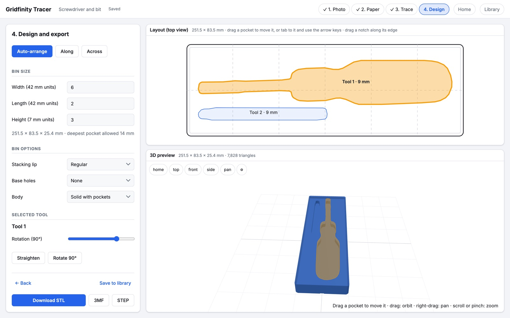
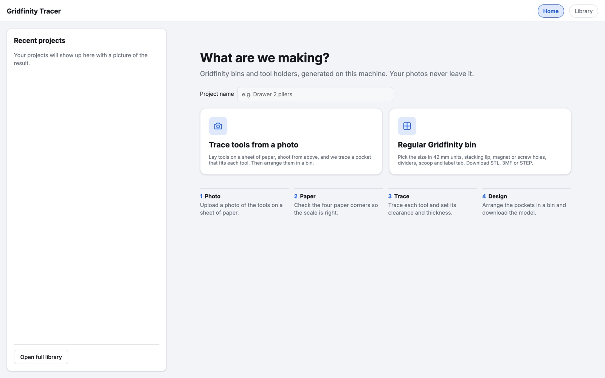
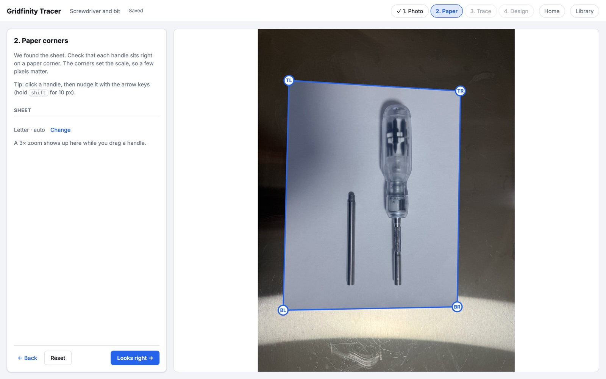
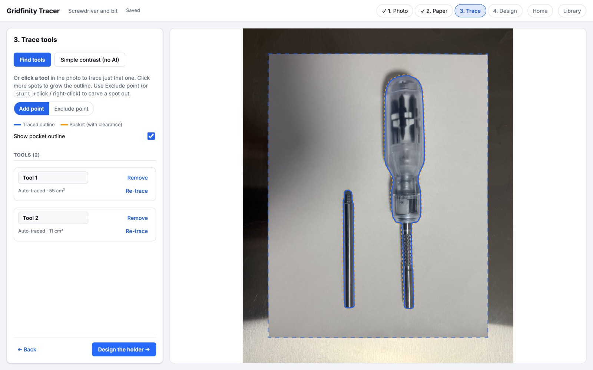
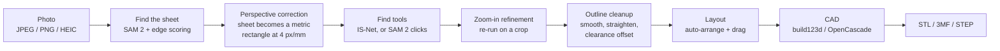

# Gridfinity Tracer

Lay your tools on a sheet of paper, snap a photo from above, and get a
[Gridfinity](https://gridfinity.xyz) bin with a pocket cut to fit each tool. Download it as STL, 3MF or STEP
and print it.

Everything runs locally in one Docker container. No accounts, no cloud, and your photos never leave the machine.

[](https://github.com/SamShmid/gridfinity-tracer/actions/workflows/ci.yml)




## Quick start

You need [Docker](https://docs.docker.com/get-docker/) (Docker Desktop on Mac or Windows is fine). No GPU needed.

```bash
git clone https://github.com/SamShmid/gridfinity-tracer.git
cd gridfinity-tracer
docker compose up --build
```

Open **http://localhost:8080**.

The first start downloads about 335 MB of AI model weights, so give it a few minutes. After that it works
offline. Your projects live in a Docker volume and survive rebuilds (`docker compose down -v` wipes them).

The image builds natively on x86_64 and arm64 (Apple Silicon included). The container is capped at 6 GB of RAM
in `docker-compose.yml`.

## How to use it

### 1. Photo



Name the project and pick **Trace tools from a photo**, or **Regular Gridfinity bin** if you just want an empty
bin. Upload a photo or take one with your phone's camera. JPEG, PNG, WebP, TIFF and iPhone HEIC all work. Pick
the paper size you used (Letter, A4, A3, Tabloid, Legal, A5 or custom).

**Getting a good photo:**

* Shoot straight down from farther away and zoom in. Close shots make tall tools look bigger (see
  [Accuracy](#accuracy)).
* Get the whole sheet in frame with all four corners visible.
* A darker, matte surface under the paper is easiest. Glossy benches work, just check the corners.
* Keep tools from touching each other or hanging off the paper.

### 2. Paper



The sheet is found automatically. Check that each handle sits right on a paper corner, since the corners set the
scale. Drag them if not. A 3x zoom shows up while you drag, and arrow keys nudge a selected handle by 1 px
(shift for 10).

### 3. Trace



Tools are found automatically when you land here. Blue is the traced outline, orange is the pocket after
clearance. If something's missing, click the tool to trace just that one and click more spots to grow the
outline (shift-click or right-click carves a spot out). Per tool you can set fit clearance, smoothing, straight
edges, mirror symmetry and tool thickness, or edit the outline point by point.

### 4. Design and export

The 2D layout and the live 3D preview sit together (screenshot at the top). **Auto-arrange** straightens every
tool and packs it into the smallest bin that fits. Drag pockets around in either view (or tab to one and use the
arrow keys), rotate them, and add finger notches so you can get the tool back out. Pocket depth follows the tool
thickness and how deep you want it to sit. You get a warning if a pocket is too deep for the bin (one click
raises the bin), too shallow to hold the tool, or the tool is bigger than the largest bin (10 x 10 units).

Pick the bin options (stacking lip, magnet or screw holes, solid or hollow body, dividers, scoop, label tab), then
hit **Download STL**, **3MF** or **STEP**.

### Library

Every project saves itself as you go: the original photo (HEIC included), the traced tools, the layout, a 3D
snapshot and every file you downloaded. Open a project from the home page or the **Library** to pick it back up,
view old models in 3D, re-download them, rename or delete.

Projects nobody opens for **90 days** are deleted automatically. Download anything you want to keep.

## Who can reach it

The app has no accounts and no password. With the default `docker-compose.yml` it listens on every network
interface, so **anyone on the same Wi-Fi or LAN can open it, upload photos, see and download every project's
photos and models, and delete projects**. That's on purpose: it's meant to be one shared library for a workshop
you trust.

* To keep it to this machine only, change the port line in `docker-compose.yml` to `"127.0.0.1:8080:8000"`.
* Don't expose it to the internet. To share it beyond one LAN, put it behind something that handles login
  (Tailscale, a reverse proxy with basic auth, etc.).

The only outbound request the app ever makes is the one-time model download. The UI font is bundled.

## How it works



1. **Finding the paper** (`backend/app/paper.py`). SAM 2 is prompted to segment the sheet several ways. Each
   candidate is scored on how rectangular it is, how bright, and how well its sides line up with real edges in
   the photo, then each side snaps to the nearest strong straight line (Hough transform). This holds up on glossy
   brushed-steel benches with glare, where the classic "biggest white quad" approach fails. If the models aren't
   downloaded yet it falls back to that classic OpenCV detector.
2. **Scale** (`paper.py`). A homography maps the four corners onto a rectangle the size of the sheet you picked,
   at 4 px per mm. From here on everything is in millimetres.
3. **Tracing** (`backend/app/segment.py`). "Find tools" runs IS-Net, a salient-object model, over the corrected
   sheet and splits the result into one mask per tool. Clicking a tool runs SAM 2 with your clicks as prompts.
   Every mask then gets a **zoom-in pass**: both models run again on a tight crop around the tool (3 to 5x more
   pixels per mm), and the smoothest result that still agrees with the original wins.
4. **Outline** (`backend/app/outline.py`). The mask becomes a polygon that's resampled and Gaussian-smoothed
   (sigma 1 mm), so pixel wobble goes away but round tips stay round. Optional extras: snap near-straight edges
   straight, mirror about the long axis (screwdrivers, wrenches), convex hull. Then it grows by the fit clearance
   plus printer compensation (default 0.2 mm), and slots narrower than 3 mm (like between plier jaws) get bridged
   so they don't print as fragile slivers.
5. **Layout** (`frontend/src/steps/DesignStep.tsx`). Each tool is turned so its long side is level
   (minimum-area rectangle), then packed in rows, lengthwise or across.
6. **CAD** (`backend/app/gridfinity.py`). build123d on OpenCascade builds the bin (base feet, walls, stacking
   lip, magnet or screw holes) and cuts each pocket and finger notch out of it. Pockets never cut below the solid
   floor (7 mm), because the feet underneath are hollow.

### Gridfinity dimensions

42 mm grid pitch, 7 mm height units, 41.5 mm cell footprint. Foot profile 0.8 / 1.8 / 2.15 mm, stacking lip
0.7 / 1.8 / 1.9 mm, corner radius 3.75 mm, magnets 6.5 x 2.4 mm, screws 3 x 6 mm, holes 8 mm in from the cell
edge, wall 0.95 mm. All in `backend/app/gridfinity.py`.

## Tech stack

| Part | What |
|---|---|
| Backend | Python 3.12, FastAPI + uvicorn, OpenCV (paper detection, homography), ONNX Runtime on CPU, Shapely (polygon offsets), build123d on OpenCascade (CAD + export), Pillow + pillow-heif (image decoding), SQLite (library) |
| Frontend | React 18, TypeScript, Vite, three.js (3D preview) |
| Packaging | One Docker image: Node builds the frontend, then `python:3.12-slim` serves the API and the built site on port 8000 as a non-root user. Base images are pinned by digest and Python packages by hash (`backend/requirements.lock`). |

### Models

Both run on the CPU through ONNX Runtime. The weights are **not** in this repo. They download into the `models`
volume on first start and get checked before use.

| Model | Used for | Size | Source | License |
|---|---|---|---|---|
| **SAM 2.1 Hiera-Tiny** (Meta) | Finding the paper, click-to-trace, refinement | ~155 MB | ONNX conversion [onnx-community/sam2.1-hiera-tiny-ONNX](https://huggingface.co/onnx-community/sam2.1-hiera-tiny-ONNX), pinned to one revision, sha256-checked | Apache-2.0 ([facebookresearch/sam2](https://github.com/facebookresearch/sam2)) |
| **IS-Net** `isnet-general-use` | "Find tools" auto-detect, refinement | ~179 MB | [DIS](https://github.com/xuebinqin/DIS) weights, fetched and md5-checked by [rembg](https://github.com/danielgatis/rembg) | Apache-2.0 (weights), MIT (rembg) |

### Speed

On an Apple M5 (10 cores), CPU only: paper detection under 1 s, IS-Net about 3 s, SAM about 1 s to embed a photo
and then about 50 ms per click, bin generation about 1 s.

## Configuration

Set these under `environment:` in `docker-compose.yml`. The defaults are fine for most people.

| Variable | Default | What it does |
|---|---|---|
| `GT_RETENTION_DAYS` | 90 | Delete projects not opened or changed for this many days |
| `GT_BLANK_DAYS` | 1 | Delete empty projects (no photo, no layout) after this many days |
| `GT_ORPHAN_DAYS` | 7 | Delete leftover working images after this many days |
| `GT_MAX_UPLOAD_MB` | 50 | Largest photo upload |
| `GT_MAX_UPLOAD_SIDE` | 3000 | Photos get downscaled to this many px on the long side |
| `GT_CUSTOM_PAPER_MAX_MM` | 1000 | Largest custom sheet side |
| `GT_PX_PER_MM` | 4 | Resolution of the corrected sheet image |
| `GT_RECTIFY_MARGIN_MM` | 25 | Margin kept around the sheet after correction |
| `GT_INFER_TIMEOUT_S` | 60 | Stop waiting on a model run after this long (504) |
| `GT_INFER_MAX_PENDING` | 6 | Model runs allowed in flight before the server answers "busy" (503) |
| `GT_CAD_TIMEOUT_S` | 120 | Kill a stuck CAD job after this long (504) |
| `GT_REMBG_MODEL` | isnet-general-use | rembg model used for auto-detect |
| `GT_SKIP_MODEL_DOWNLOAD` | 0 | Set to 1 to start without downloading weights (classic detector only) |
| `GT_USER` | tracer | User the server runs as inside the container |

### Limits

One container serves everyone on the LAN, so requests are fenced in. Uploads max out at 50 MB and 100
megapixels (checked from the file header before decoding). JSON bodies are capped at 2 MB and snapshots at 3 MB,
counted while reading, so a chunked upload can't sneak past. Every number is bounded to the UI's range, every
coordinate has to be finite, and every id has to be 12 hex characters. Bad input gets a plain 400 / 413 / 422,
never a stack trace. Model runs use a 2-thread pool. CAD uses a 2-process pool that gets killed and recycled if
OpenCascade hangs. Generated models are cached (32 entries, 128 MB max), so re-previewing the same design is
instant.

### Retention

A sweep runs at startup and every 24 hours. It deletes projects untouched for 90 days, blank projects after a day,
and orphaned working images after 7 days, and logs everything it removes. Opening a project restarts its clock.
Each project in `GET /api/library` has an `expires_at`.

## Accuracy

* **Paper size and corners set the scale.** Pick the wrong sheet and everything scales with it. Always glance at
  the corners in step 2.
* **Parallax.** A tool 20 mm tall shot from 50 cm away traces about 4% oversize. Shoot from farther away and zoom
  in. (The `/api/polygon/offset` endpoint can correct for it with `tool_height_mm` and `camera_distance_mm`, but
  that isn't in the UI yet.)
* **Clearance.** 0.3 to 0.5 mm gives a snug fit on a well-tuned printer, 1 mm or more to drop tools in easily.
  The 0.2 mm printer compensation goes on top to absorb over-extrusion and elephant foot.
* **Silver tools on white paper** are hard for plain contrast. Use "Find tools" or click-to-trace instead of
  "Simple contrast".
* The paper detector was tuned on the 10 iPhone photos in `gridfinity-tracer-photos/` (glossy brushed-steel
  bench) and gets all 10 right. Overlays are in [`docs/eval-2026-09-22/`](docs/eval-2026-09-22/) and per-tool
  traces in [`docs/trace-review-2026-09-22/`](docs/trace-review-2026-09-22/).

## Development

Run the backend and frontend separately with hot reload:

```bash
# backend (Python 3.12 + uv: https://docs.astral.sh/uv/)
cd backend
uv venv --python 3.12
uv pip install --require-hashes -r requirements.lock
uv pip install -e ".[dev]"
.venv/bin/python scripts/download_models.py          # into ../models
.venv/bin/python -m uvicorn app.main:app --reload --port 8000

# frontend, in another terminal
cd frontend
npm install
npm run dev                                          # http://localhost:5173, proxies /api to :8000
```

The same checks CI runs:

```bash
cd backend  && .venv/bin/ruff format --check . && .venv/bin/ruff check . && .venv/bin/python -m pytest
cd frontend && npm run format:check && npx tsc --noEmit && npm run build
```

* `backend/tests/synth.py` renders a synthetic photo (a Letter sheet under perspective with a known tool) that the
  pipeline tests trace and compare against ground truth. `tests/test_api.py` covers the HTTP layer: id validation,
  size limits, bounds, retention and concurrency edge cases. `tests/test_real_photos.py` runs the paper detector
  on the 10 real photos. Tests that need model weights skip when they're missing.
* `backend/scripts/batch_eval.py <photos> <out>` draws corner and outline overlays for a folder of photos.
* After changing Python dependencies, regenerate the lock:
  `uv pip compile pyproject.toml --universal --python-version 3.12 --generate-hashes -o requirements.lock`.
* uvicorn runs with **one worker on purpose** (see `docker/entrypoint.sh`): the caches and worker pools live in
  the process, and concurrency comes from the pools.
* `frontend/src/theme.ts` holds every colour (light and dark), font, size and spacing and writes them to `:root`
  as CSS variables. Change a token there and it changes everywhere.
* `three` is pinned to an exact version because the viewer patches OrbitControls internals.

### Layout

```
backend/app/
  main.py        FastAPI routes, request limits, worker pools, serves the built frontend
  paper.py       paper detection + homography
  segment.py     classic / IS-Net / SAM 2 masks, zoom-in refinement
  outline.py     mask -> polygon, smoothing, clearance offset
  gridfinity.py  bin CAD (build123d) + STL / 3MF / STEP export
  library.py     SQLite + on-disk project library, retention sweep
  schemas.py     request models with the UI's bounds
  imageio.py     image decoding (HEIC, 16-bit, EXIF rotation)
backend/scripts/ model download, eval overlays
backend/tests/   pytest suite
frontend/src/
  HomeView.tsx, LibraryView.tsx
  steps/         UploadStep, PaperStep, ToolsStep, DesignStep
  StlViewer.tsx  three.js viewer (orbit, pan, zoom to cursor, drag pockets)
  theme.ts       design tokens
docker/entrypoint.sh   downloads models on first start, drops to the app user, runs uvicorn
```

## Credits and license

MIT, see [LICENSE](LICENSE). Built on:

* **SAM 2.1** by Meta (Apache-2.0), through the
  [onnx-community](https://huggingface.co/onnx-community/sam2.1-hiera-tiny-ONNX) ONNX conversion.
* **IS-Net** from [Dichotomous Image Segmentation](https://github.com/xuebinqin/DIS) by Xuebin Qin et al.
  (Apache-2.0), fetched through [rembg](https://github.com/danielgatis/rembg) (MIT).
* **build123d** (Apache-2.0) on **OCP** (Apache-2.0) for **Open CASCADE Technology** (LGPL-2.1 with exception,
  dynamically linked), plus **lib3mf** (BSD) for 3MF.
* **OpenCV** (Apache-2.0), **ONNX Runtime** (MIT), **Shapely** (BSD), **NumPy** (BSD), **FastAPI** (MIT),
  **Pillow** (MIT-CMU).
* **pillow-heif** (BSD-3) for iPhone photos. Its wheels bundle libheif and libde265 (LGPL-3) and the x265 encoder
  (GPL-2). The app only decodes, and those libraries stay inside the wheels in the container image; none of their
  code is in this repo. HEVC is patent-encumbered in some countries.
* **React**, **three.js** and **Vite** (MIT), and the **Inter** font by Rasmus Andersson (SIL OFL 1.1, bundled in
  `frontend/public/fonts/`).
* Bin geometry follows the [Gridfinity](https://gridfinity.xyz) spec by Zack Freedman. Some ideas borrowed from
  [tracefinity](https://github.com/tracefinity/tracefinity) (MIT).
